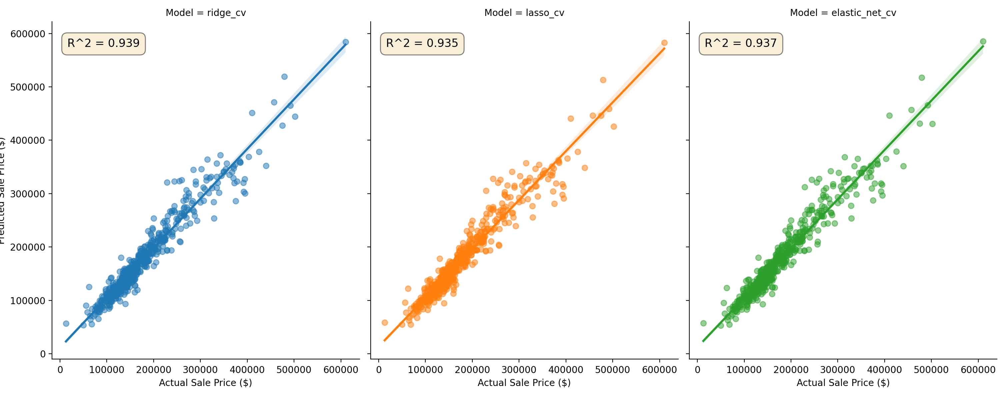

# Ames Housing Price Prediction

This repository contains a project based on the Kaggle Ames Housing dataset, which can be found on this [page](https://www.kaggle.com/datasets/shashanknecrothapa/ames-housing-dataset).
This feature rich dataset, contains 79 useful features that can be useful in many ways to predict a final House Price.
In here I focused on robust regressions models that can accurately predict sales prices based on the Ames Housing dataset. 
This project explores the data, engineers relevant features and trains several regularized linear regression model, Lasso, 
Ridge and Elastic Net.

### Table of Contents

* [Introduction](#introduction)
* [Features](#features)
* [Directory Structure](#directory-structure)
* [Getting Started](#getting-started)
* [Usage](#usage)
* [Configuration](#configuration)
* [Model Performance](#model-performance)

### Introduction

This project focuses on the task of predicting house sale prices using the Ames Housing Dataset, which features 79 variables
describing pretty much everything from neighborhood characteristic to the number of bathrooms.

### Features

I tried to provide an in-depth Exploratory Data Analysis (EDA) that can be found in the [Jupyter Notebook](./notebooks/01_Exploratory_Data_Analysis.ipynb).
This analysis was my first step in starting this project, as the analysis was crucial for understanding feature distributions,
correlations or missing data.

In [data_processing.py](./src/data_processing.py) I spent the most effort. This was a continuation of my EDA notebook, in which
I drove home the points I made previously. A brief summary of the key transformations include:
* Handling missing values: The missing values were handled based on the context. For example a missing `Garage Type` feature 
  was filled with "None", whereas missing `Lot Frontage` was replaced with the median value for the particular neighbourhood 
* Creating new features: New features like `Total SF` (total square footage) and `House Age` were created to capture more complex relationships
* Log Transformation: The target variable `Sale Price` was transformed using `np.log1p` in order to normalize its distribution
  with the end goal of improving the performance of future prediction models

Regarding the models themselves, in this project I implemented a training pipeline for three regression models, well suited for
dataset with a high number of features:
* RidgeCV
* LassoCV
* ElasticNetCV

To evaluate the models, the primary metric used was Root Mean Square Error between the predicted value and the actual sale value.
This metric is standard for this type of regression problem and penalizes larger errors more heavily.


###  Dataset

As mentioned a bit earlier, the dataset uses the Ames Housing dataset, which contains 2930 rows with a total of 82 features
per row. From that we can use 79 features that describe various aspects of residential homes.

###  Project Structure

```
.
├── README.md
├── config
│   ├── base_config.yaml
│   ├── elastic_net_cv.yaml
│   ├── lasso_cv.yaml
│   └── ridge_cv.yaml
├── data
│   ├── AmesHousing.csv
│   ├── X_test.npy
│   └── y_test.npy
├── models
│   ├── elastic_net_cv.joblib
│   ├── lasso_cv.joblib
│   └── ridge_cv.joblib
├── notebooks
│   └── 01_Exploratory_Data_Analysis.ipynb
├── requirements.txt
└── src
    ├── data_processing.py
    ├── evaluate.py
    ├── feature_selection.py
    ├── train.py
    └── utils.py
```
* `config` contains YAML files for configuring the models and data paths
* `data` where the raw and processed data is stored
* `models` where the trained models are stored
* `notebooks` contains Jupyter Notebook for EDA
* `src` python source code for data processing, training and evaluation
* `requirements.txt` required packages for this project


###  Getting started

To get this up and running, please follow these steps:

1. Clone the repo
    `git clone git@github.com:RaresPopa22/AmesHousing.git`
2. Install Python packages
    `pip install -r requirements.txt`
3. Download the dataset
    Download the dataset 'Ames Housing dataset' from [Kaggle](https://www.kaggle.com/datasets/shashanknecrothapa/ames-housing-dataset#:~:text=Download)

### Usage

You can choose to train the models, or use the saved models, and evaluate their performance using the script in the src/
directory.

#### Training the Models

In order to train a model, run the `train.py` script with the desired configuration:

* Train RidgeCV
    `python -m src.train --config config/ridge_cv.yaml`
* Train LassoCV
    `python -m src.train --config config/lasso_cv.yam`
* Train ElasticNetCV
    `python -m src.train --config config/elastic_net_cv.yaml`

#### Evaluating the models

After training, you can evaluate and compare the models using the evaluate.py script:
`python -m src.evaluate --models models/ridge_cv.joblib models/lasso_cv.joblib models/elastic_net_cv.joblib --x-test data/X_test.npy --y-test data/y_test.npy`

This will print the evaluation metrics (like RMSE) and use faceted plots to do a side by side comparison of the different models used.

### Configuration

This project uses YAML files for configuration, making it easy to manage model parameters and data paths.

* `base_config.yaml` contains the base configuration, including data paths
* `elastic_net_cv.yaml`, `lasso_cv.yaml` and `ridge_cv.yaml` contains model-specific parameters

### Model Performance

In order to get an accurate evaluation of the performance, 20% of the original data was held out in the training phase.
This was done in order to assess the models' performance on unseen data. The main metric used for comparison is Mean Square Error.

The table below summarizes the performance of the two models:

| Model   | R-squared  | Mean Absolute Error (MAE) | Root Mean Squared Error (RMSE |
|---------|--------|---------------------------|----------------|
| RidgeCV | 0.939 |  $12,957.715                    |  $19,506.390 |
| LassoCV    |  0.935 | $13,389.106                   |  $20,090.823 |
| ElasticNetCV    |  0.937 | $13,176.707                  |  $19,818.924 |


The ranking is clear: Ridge, Elastic Net and lastly, Lasso.

All three models are performing at a good level, however RidgeCV outperforms on every metric:
* does a better job of accounting why house price are different from one another (R-squared)
* lowest average error (MAE)
* lowest error when penalizing large mistakes (RMSE)

The results are also an evidence that the data preprocessing was an effective one. The handling of skewness, outliers
and multicollinearity paid off in the end. 

I will end this section with the graph for all three models:


While RidgeCV is numerically the best, we can see that all three models have learned a nearly identical relationship between
features and the sale price. This could also back up the data processing stage. 